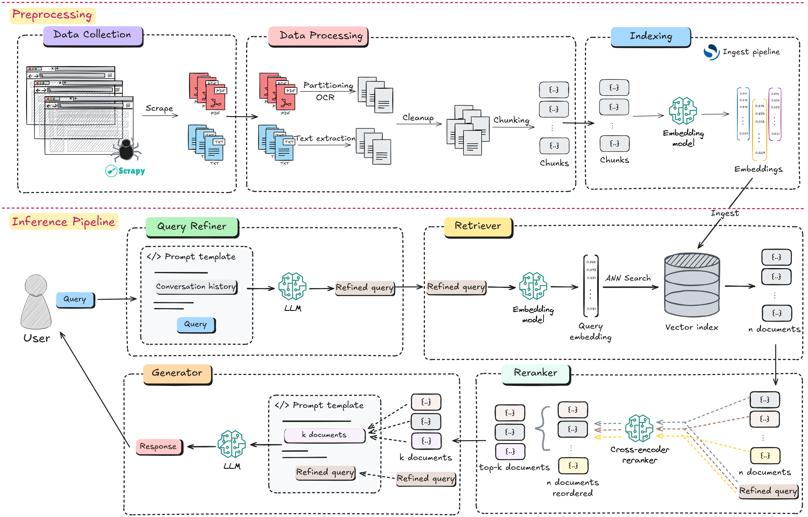
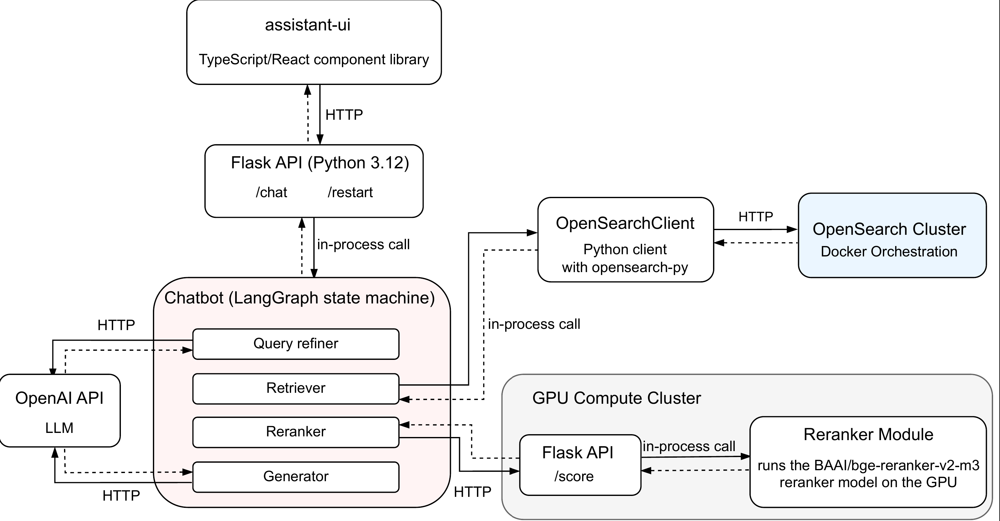

# RAG Pipeline: End‑to‑End Neural Retrieval and Grounded Generation

Multilingual RAG system that crawls, parses, indexes, retrieves, reranks, and generates grounded answers over organizational knowledge, with end‑to‑end Docker orchestration and OpenSearch‑native neural search. Designed and implemented as a Bachelor’s [thesis project](thesis.pdf), emphasizing source attribution, modularity, and leveraging pre-trained deep learning models.

### Architecture overview



The system is split into two pipelines:

- **Preprocessing**: executed once to prepare the knowledge base, or periodically to
update it. It performs data collection with [Scrapy](https://www.scrapy.org/) + [Selenium](https://selenium-python.readthedocs.io/), layout parsing and table extraction with [unstructured](https://github.com/Unstructured-IO/unstructured) and [PyMuPDF](https://pymupdf.readthedocs.io/en/latest/), OCR via [Tesseract](https://github.com/tesseract-ocr/tesseract) (`tesseract-ron` data), cleaning, sentence‑aware chunking, embedding and indexing through an [OpenSearch](https://opensearch.org/) ingest pipeline.

- **Inference**: a [LangGraph](https://www.langchain.com/langgraph)‑orchestrated flow refines the user query using conversation state, performs neural retrieval against the same multilingual embedding model, applies cross‑encoder reranking for fine‑grained relevance, and prompts the LLM to synthesize an answer with explicit source citations.


### Software components



A Flask API (Python 3.12) hosts the LangGraph pipeline and exposes /chat and /restart endpoints, while the OpenSearch client ([`opensearch‑py`](https://pypi.org/project/opensearch-py/)) runs in‑process for low‑latency retrieval operations.

- OpenSearch cluster runs in Docker; an ingest pipeline maps "text" → "embedding" using [paraphrase‑multilingual‑MiniLM‑L12‑v2](https://huggingface.co/sentence-transformers/paraphrase-multilingual-MiniLM-L12-v2). 
- A GPU compute service exposes a /score Flask endpoint for the reranker module, decoupled so it can scale independently or be swapped without touching retrieval components.
- The LLM provider is abstracted via [LangChain](https://www.langchain.com/), allowing drop‑in replacement of models (e.g., GPT‑4o‑mini) without architectural changes.


### Crawler

[Scrapy](https://www.scrapy.org/)-based web crawler for interacting with dynamic web pages. It is designed to extract PDFs and page content from selected URLs (loaded from the `urls.json` file) and save them in a structured format with accompanying metadata.

Features:
* Store content in human-readable form.
* HTML content extraction using [trafilatura](https://trafilatura.readthedocs.io/en/latest/) for meaningful page text.
* Generate structured metadata.
* Filter outdated file versions: includes a `TARGET_DATE` parameter (default: 2024-10-01) to skip old documents based on the HTTP Last-Modified header. This prevents collecting outdated PDFs from previous years that are still published on the site.

#### Run crawler
```
cd crawler/crawler/spiders
scrapy crawl upb
```

### Evaluation

The system was evaluated end‑to‑end using two methods: an LLM‑judge protocol (GPT Score) and [RAGAs](https://docs.ragas.io/en/stable/) metrics, each measuring faithfulness to retrieved context and answer relevance to the user query.

- **Metrics:** **GPT‑4.1** was prompted with rubric‑style instructions to score **faithfulness** and **answer relevance**; RAGAs computed Faithfulness via claim‑support checks with a judge LLM and Answer Relevance via cosine similarity between embeddings of synthetic questions and the original query using the same multilingual model.
- R**eranker ablation and k‑sweep:** Across k ∈ {3,5,7}, adding the cross‑encoder reranker consistently improved **MAP@k, MRR@k, faithfulness, and answer relevance**; k = 5 provided the best trade‑off between context sufficiency and noise, and was selected as default.
- **Generator comparison:** With k = 5 and temperature 0, **GPT‑4o‑mini** achieved the strongest overall balance of faithfulness, answer relevance, and latency; **DeepSeek‑V3‑0324** trailed with higher latency and cost, while **Gemma‑3n‑E4B** underperformed but offers open‑source/local deployment advantages.
- **Sanity checks:** Negative‑control prompts yielded near‑zero scores across metrics, validating the evaluation harness; a small non‑zero RAGAs relevance arose from embedding‑space cosine similarity not being strictly orthogonal for unrelated texts.


### Quick Start

#### Virtual environment setup
```
python3 -m venv env && source env/bin/activate
pip install --upgrade pip
pip install -r requirements.txt
```
`Python 3.12` was used.

#### Activate virtual environment
```
source env/bin/activate
```

Install [tesseract](https://tesseract-ocr.github.io/tessdoc/Installation.html) with Romanian language support:

```
sudo pacman -S tesseract tesseract-data-ron
```

#### OpenSearch Dashboard
[Neural search tutorial](https://opensearch.org/docs/latest/search-plugins/neural-search-tutorial/)

Open: `http://localhost:5601/` \
Default username: `admin` \
Password: `$OPENSEARCH_INITIAL_ADMIN_PASSWORD`

#### Docker setup
Install `docker` and `docker-compose`
 ```
 sudo pacman -Sy docker docker-compose
 sudo systemctl enable docker.service
 sudo systemctl start docker.service  
 sudo usermod -aG docker $USER
 ```
To [set up a custom admin password](https://opensearch.org/docs/latest/security/configuration/demo-configuration/#setting-up-a-custom-admin-password), do one of the following:

- run: `export OPENSEARCH_INITIAL_ADMIN_PASSWORD=<passwd>`
- create an `.env` file with: `OPENSEARCH_INITIAL_ADMIN_PASSWORD=<passwd>`

Create and start the cluster as a background process
```
docker compose up -d
```

