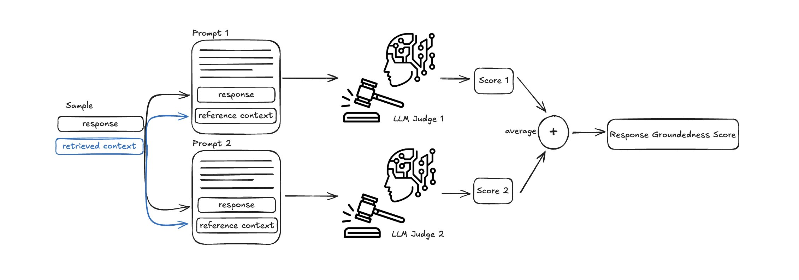
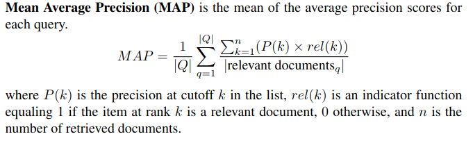
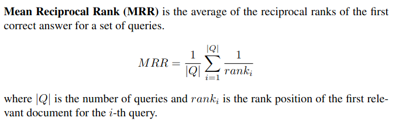

# Evaluation plan

## 1. Test set creation

### A. Synthetic Q&A dataset generation

Get 10 documents, ask gpt to make 30 q&a pairs, indicate relevant passages that contain the answers.

Manually verify and filter the questions, select 20 best pairs.

Result: a list of 20 tuples of (question, answer, list of relevant passages)

---
tried it -> **not** a good approach...

#### Conclusions:
Including only one document per QA pair resulted in many false negatives; in reality, multiple documents might contain relevant information, but because they wrongfully penalized, marked as irrelevant, MAP@k does not reflect the real usefulness of the retrieval component

#### Alternative:
Use LLM as a judge to determine whether each retrieved passage is relevant to the query

### B. Questions generation based on chatupb conversations analysis

Gather user queries from the chatupb conversations, perform semantic clustering of queries, analyze the densest clusters and formulate a small set of questions based on the most common queries.

## 2. Retriever evaluation

Instead of manual labels, use LLM as a judge to determine if a retrieved passage is relevant to the user query.

Use prompts translated from [RAGAs' Nvidia Merics](https://docs.ragas.io/en/latest/concepts/metrics/available_metrics/nvidia_metrics/#context-relevance).

*[photo source](https://x.com/ragas_io/status/1899150780017545712/photo/1)*

### 2.1 MAP@k

*Source: [Evaluation of Retrieval-Augmented Generation: A Survey](https://arxiv.org/pdf/2405.07437v2)*

### 2.2 MRR@k

*Source: [Evaluation of Retrieval-Augmented Generation: A Survey](https://arxiv.org/pdf/2405.07437v2)*

## 3. Reranker evaluation

Retrieve n>k passages (n=15), then rerank and select top k (k=5). Use the same metrics as for the retriever.

### 3.1 MAP@k

### 3.2 MRR@k

## 4. End-to-end system evaluation

Use **GPT Score** and **RAGAs** to measure faithfulness and answer relevance, as described in *[Ragas: Automated Evaluation of Retrieval Augmented Generation](http://arxiv.org/abs/2309.15217)*.

**GPT Score**: use GPT-4.1 as a judge, ask it to assign a score between 0-10 to measure faithfulness / answer relevance. Generate prompts based on the translated prompt templates from the *[RAGAs paper](http://arxiv.org/abs/2309.15217)*.

### 4.1 Faithfulness

### 4.2 Answer relevance

## 5. Performance

TODO

